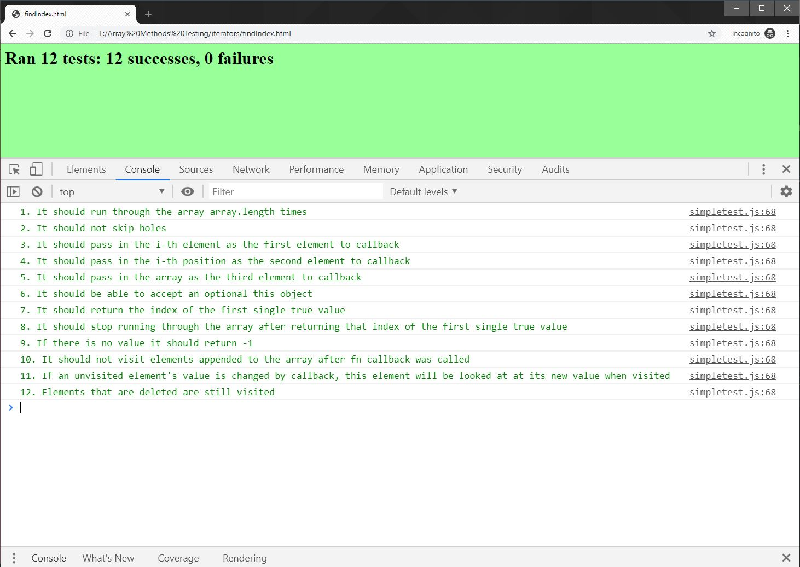
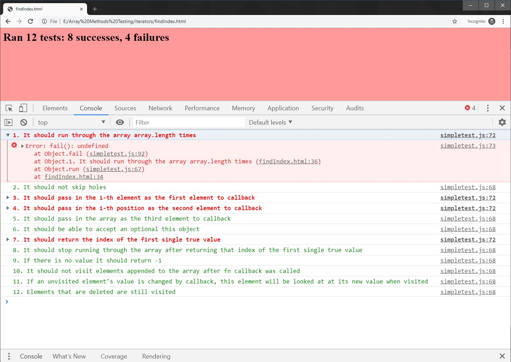

# Javascript Array Methods Recreations

Part of the [Watch and Code®](https://watchandcode.com/) advanced curriculum, this project is a work-in-progress building and testing series of functions that imitate the established behaviours of Javascript array methods based on [Joe Walnes's unit testing library](https://github.com/joewalnes/jstinytest). Taking the Test-Driven Development (TDD) approach, each test makes sure the re-created function satisfies the requirements of the corresponding native JS method.

## List of methods tested (work-in-progress)
Iterators
``` console
Array.prototype.forEach()
Array.prototype.filter()
Array.prototype.map()
Array.prototype.reduce()
Array.prototype.find()
Array.prototype.findIndex()
Array.prototype.every()
Array.prototype.some()
Array.prototype.reduceRight()
```

Accessors
``` console
Array.prototype.concat()
Array.prototype.indexOf()
Array.prototype.lastIndexOf()
Array.prototype.includes()
Array.prototype.slice()
Array.prototype.join()
```

Mutators
``` console
Array.prototype.push()
Array.prototype.pop()
Array.prototype.shift()
Array.prototype.unshift()
Array.prototype.fill()
Array.prototype.reverse()
Array.prototype.copyWithin() - to be added
Array.prototype.sort() - to be added
Array.prototype.splice() - to be added
```

## Visuals
Success sample


Failure sample


## Contributing
Pull requests are welcome. For major changes, please open an issue first to discuss what you would like to change.

Please make sure to update tests as appropriate.


## License
[MIT](https://choosealicense.com/licenses/mit/)
